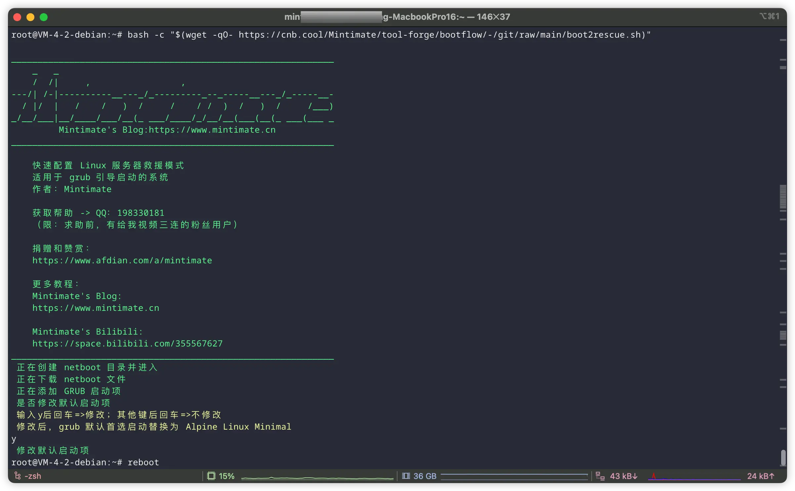
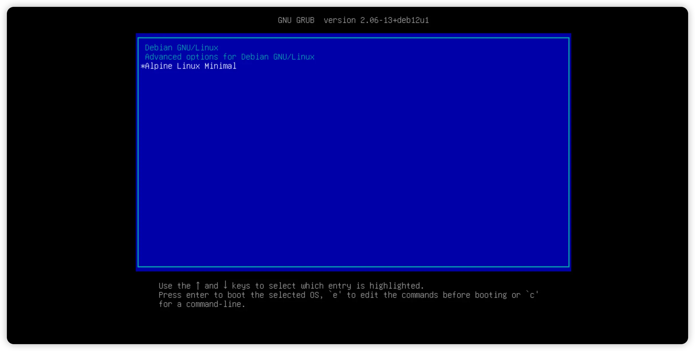
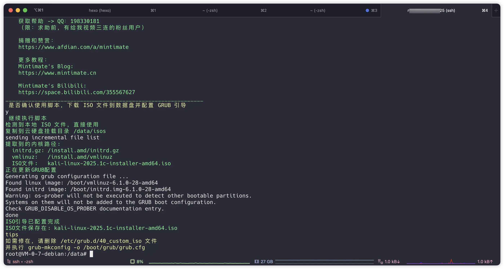

# BootFlow 🚀
​​极简系统引导工具集​​ | "From BIOS to System, Simply Boot."

脚本：
- boot2rescue.sh: 在 Linux 设置上安装一个救援模式系统（支持 x86 和 ARM64架构）。
- boot2cbs.sh: 将用户提供的 ISO 文件（系统镜像）下载或移动到已挂载的云硬盘中，使其可以在 Grub 引导并加载。

## Alpine 救援模式

适用于在云厂商的云服务器上，通过救援模式进入系统。部分云厂商有提供独立的救援模式（比如： 腾讯云），那么理论上不需要使用本工具。

```bash
bash -c "$(wget -qO- https://cnb.cool/Mintimate/tool-forge/bootflow/-/git/raw/main/boot2rescue.sh)"
```



> Debian 12 等高版本系统，默认重启是快速重启，可能需要使用`reboot -f` 强制重启才可以进入 grub 引导界面。

安装后，可以在开机引导内进行选择：



## 挂载ISO到Grub引导

适用于在云厂商的云服务器上，通过提前挂载一块云硬盘，使其可以自动下载 ISO 文件，然后通过 Grub 引导进入 ISO 的安装界面。

操作前提：**提前挂载一块云硬盘，使其可以自动下载 ISO 文件，脚本会自动下载或复制 ISO 到云硬盘更目录的 isos 目录下**。

```bash
# 下载脚本
wget https://cnb.cool/Mintimate/tool-forge/bootflow/-/git/raw/main/boot2cbs.sh
# 执行脚本
bash boot2cbs.sh -i <ISO文件路径/ISO下载地址>
```



挂载后，可以在开机引导内进行选择：


## Licence

[](LICENSE)